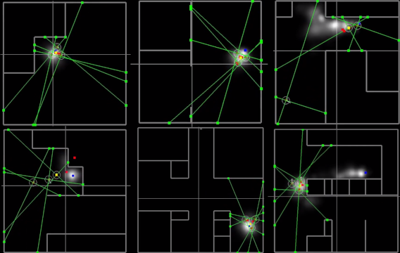

# AutoGDM: Fully Automated Gas Dispersion Modelling, And Environment Generation.

[](https://www.youtube.com/watch?v=ipoG9ExczbE)


AutoGDM is the first fully automated gas dispersion modelling (GDM) and environment generation pipeline. It uses the ROS [GADEN](https://github.com/MAPIRlab/gaden) package as a filament simulator, and [OpenFOAM](https://www.openfoam.com/) CFD to generate a 3D flow field. We used AutoGDM to evolve the parameters of 'Sniffy Bug', the algorithm used onboard the first fully automated swarm of gas-seeking nano quadcopters.

 - [Paper](https://arxiv.org/abs/2107.05490)
  
 -  [Video](https://www.youtube.com/watch?v=hj_SBSpK5qg) 

 -   [TU Delft MAVLab](https://mavlab.tudelft.nl/)

When using AutoGDM, please cite our work:
```
@misc{duisterhof2021sniffy,
      title={Sniffy Bug: A Fully Autonomous Swarm of Gas-Seeking Nano Quadcopters in Cluttered Environments}, 
      author={Bardienus P. Duisterhof and Shushuai Li and Javier Burgués and Vijay Janapa Reddi and Guido C. H. E. de Croon},
      year={2021},
      eprint={2107.05490},
      archivePrefix={arXiv},
      primaryClass={cs.RO}
}
```

# Installation

First clone the library including the submodules:

```
git clone --recursive https://github.com/tudelft/AutoGDM.git
```


AutoGDM heavily relies on Python3. To install the required packages, please use:
```
pip3 install numpy matplotlib opencv-python argparse imageio PyFoam imutils pandas
```
We use java to convert 2D randomly generated environments to 3D CAD files. To install java in Ubuntu use:

```
sudo apt install default-jre
```
Then to check the installation:
```
$ java -version
openjdk version "11.0.11" 2021-04-20
OpenJDK Runtime Environment (build 11.0.11+9-Ubuntu-0ubuntu2.20.04)
OpenJDK 64-Bit Server VM (build 11.0.11+9-Ubuntu-0ubuntu2.20.04, mixed mode, sharing)
```

OpenFoam is the open-source CFD library we use to generate wind fields. To install it:

```
sudo sh -c "wget -O - http://dl.openfoam.org/gpg.key | apt-key add -"
sudo add-apt-repository http://dl.openfoam.org/ubuntu
sudo add-apt-repository "http://dl.openfoam.org/ubuntu dev"
sudo apt-get update
sudo apt-get install openfoam7
```
Then add the following to your bashrc file:
```
vim ~/.bashrc
source /opt/openfoam7/etc/bashrc
```
This will allow AutoGDM to run OpenFOAM directly from the terminal. To test your OpenFOAM installation, open a **new** terminal and try:
```
simpleFoam -help
```
The final step is to install ros and the required packages. To install ROS, follow the instructions [here](http://wiki.ros.org/ROS/Installation). So far Noetic has been tested, but Melodic should work too (and probably Kinetic too).  

If you pulled recursively, the simulation_ws folder should contain all ROS packages required. Make the simulation_ws folder your catkin workspace. If you don't want to use this folder as catkin workspace, change it to your preference in /runtime/settings.py. For more help in creating a catkin workspace, follow [this link](http://wiki.ros.org/catkin/Tutorials/create_a_workspace). 

Build the workspace by the following commands:
```
cd simulation_ws
catkin_make install
```
The packages should build without any problems. Don't forget to source your new catkin workspace (simulation_ws), by running
```
source devel/setup.bash
```
Otherwise ROS won't be able to find the packages we just installed. 

# Running AutoGDM

The first step is to generate some environments to simulate gas.:

```
cd runtime
python3 dungeon_generator.py n_envs
```
Here n_envs is the number of environments that is generated. Top-view images will be stored in environments/pics/white_walls.

We should now be able to run AutoGDM!

```
cd runtime
python3 main.py
```
Upon completion the gas data can be found in `simulation_ws/src/gaden/env/rand_env_i/gas_simulations`.


# Contact

Please reach out to us if you encounter any problems or suggestions. AutoGDM is a work in progress, we are excited to see it beeing used! Reach out to Bart for all technical questions.

### Contributors
Bart Duisterhof - Student & Maintainer - bduister@cs.cmu.edu <br />
Prof. Guido de Croon - PI - G.C.H.E.deCroon@tudelft.nl
